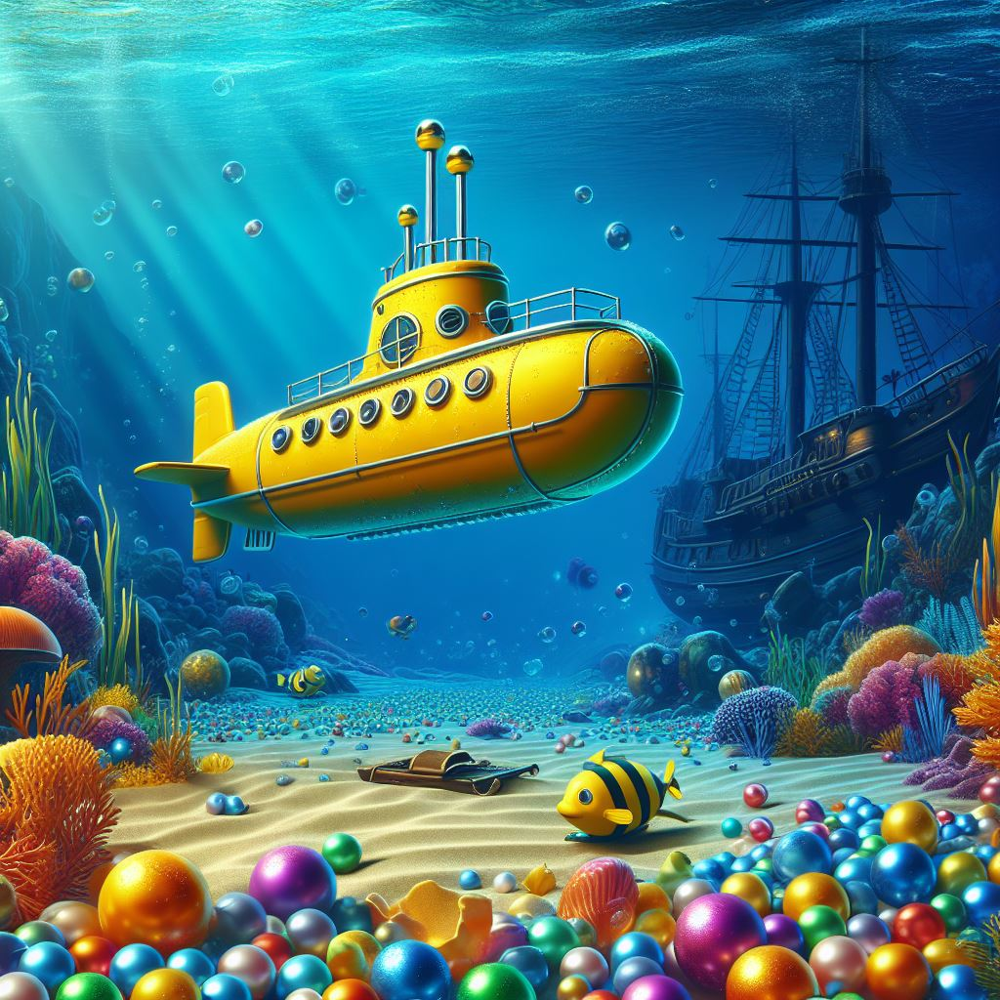

# Használati útmutató

  

A program a Hunter Dénes.exe fájl megnyitásával indítható.

A képernyő középső részén található térben a WASD gombokkal tudunk mozogni és az egér jobb gombját lenyomva tartva, közben az egeret mozgatva forogni.

A jobb oldalon találhatóak az információk a random pálya generálásához. Beállítható, hogy milyen intervallumon generálja az akvárium méretét mindhárom irányban. Beállítható,
hogy milyen intervallumban generálja a gyöngyöket, illetve, hogy milyen értékű lehessen maximum egy gyöngy. A generálás gombra kattintva létrejön az új véletlengenerált pálya.

 
 

  
  
  

 
 

A gyöngyök beolvasása feliratú gombra kattintva megjelenik egy új ablak. Itt tudjuk kitallózni txt fájlokat és kiválasztani a betöltendő pályát. A nézőpontot tetszőleges pozíciókba
helyezhetjük. Ehhez meg kell adnunk a kívánt koordinátákat és rá kell kattintani a kamera lerakás feliratú gombra. Az út keresése gombra kattintva meghatározhatun egy útvonalat,
amelyet a program a beállított sebesség és idő függvényében határoz meg. A futási idő egy ablakban megjelenik ms mértékegységben egy új ablakban, ha előzetesen be van pipálva a
stopper. Megjelenik továbbá a képernyő bal oldalán az összes felszedett gyöngy koordinátája és értéke. A térben a kiválasztott gyöngyök vonalakkal vannak összekötve. Egy ilyen
mezőre duplán kattintva az adott gyöngyhöz juthatunk a 3D-s térben. Megjelenik továbbá az összeszedett gyöngyök mennyisége és pontértéke.

A program C# nyelven íródott. A WPF és a HelixToolkit.WPF keretrendszereket használtuk. Visual Studio 2022 környezetben dolgoztunk.

  &nbsp;
  &nbsp;

Készítette:
- [Sinka József](https://github.com/Joj007)
- [Szidor Mihály](https://github.com/szidimisi68)
- [Majaros Péter](https://github.com/Majoros-Peter)

Debreceni SZC Mechwart András Gépipari és Informatikai Technikum 12.B osztályos tanulók.

Munka kezdete: 2024.03.23.

Munka befejezése: 2024.04.03.

  

